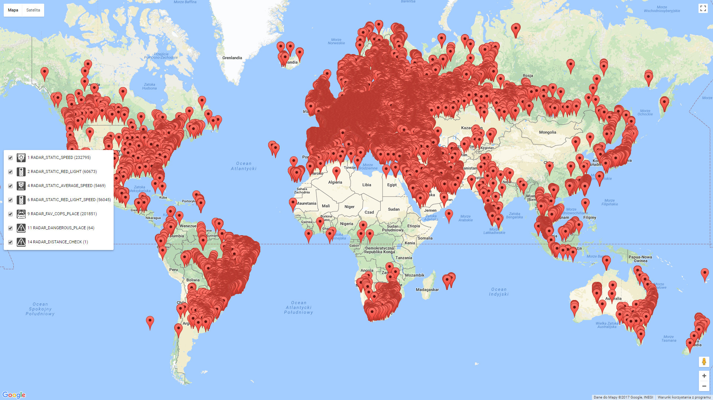

# Sygic OfflineSpeedcams


[](https://opensource.org/licenses/MIT)
[](https://saythanks.io/to/miszellek)


Converter Speed Camera / Photo Radar from another formats (only from IGO at this time) to Sygic offlinespeedcams.dat



## Pre Requisites

Install python3:

- **Windows**: download 3.x from [python.org downloads](https://www.python.org/downloads/windows/). Make sure the option to "Add Python to PATH" is checked.

- **OSX**: use `brew` to install python3 with `brew install python3`

- **Linux**: there is a very good chance your Linux distribution has Python installed already, just make sure it's python3.

## Installing

Click in the "Clone or Download" button, then "Download ZIP". Extract contents.


## Usage

Put your `offlinespeedcams.dat` file in same folder as `offlinespeedcams.py`. If you don't want use an existing one, another will be created, but you'll loose `OfflineZone` and `OfflineSpeedcam` previous records.

Then, open a terminal/command-prompt and run one the following:


Basic example: 
```
python offlinespeedcams.py speedcam.txt
```

Several speedcam.txt files:
```
python offlinespeedcams.py speedcam_A.txt speedcam_AND.txt speedcam_B.txt speedcam_BG.txt speedcam_BiH.txt speedcam_BY.txt speedcam_CH.txt speedcam_CY.txt speedcam_CZ.txt speedcam_D.txt speedcam_DK.txt speedcam_E.txt speedcam_EST.txt speedcam_F.txt speedcam_FIN.txt speedcam_FL.txt speedcam_GB.txt speedcam_GR.txt speedcam_H.txt speedcam_HR.txt speedcam_I.txt speedcam_IRL.txt speedcam_IS.txt speedcam_KOS.txt speedcam_L.txt speedcam_LT.txt speedcam_LV.txt speedcam_M.txt speedcam_MA.txt speedcam_MK.txt speedcam_MNE.txt speedcam_N.txt speedcam_NL.txt speedcam_P.txt speedcam_PL.txt speedcam_RO.txt speedcam_RUS.txt speedcam_S.txt speedcam_SK.txt speedcam_SLO.txt speedcam_SRB.txt speedcam_TR.txt speedcam_UA.txt 
```

With debug information:
```
python offlinespeedcams.py --debug speedcam.txt
```

With custom 'type' translator:
```
python offlinespeedcams.py --debug --igotypes 1=1,2=6,3=2,4=4,5=9,7=5,8=11,9=16,11=2,15=12,30=10,31=11 speedcam.txt
```


## FAQ

**What for is a --igotypes switch?**

It's the option to specify how speed camera types will be translated between iGo and Sygic.

Igo types of speed camera:
```
1 - fixed speed camera
2 - red light and speed camera / build-in
3 - red light camera
4 - average speed camera
5 - mobile speed camera, lasers, hand-held radars and other 
6 - railroad crossing
7 - bus line camera
8 - high accident zone / dangerous way
9 - school zone
10 - town entry point
11 - red light and speed camera
12 - toll booth
13 - hospital, ambulance
14 - fire station
15 - congestion charge zone
30 - stickers camera
31 - dangerous area
```

Sygic types of speed camera:
```
0 - RADAR_SYMBOL
1 - RADAR_STATIC_SPEED
2 - RADAR_STATIC_RED_LIGHT
3 - RADAR_SEMIMOBILE_SPEED
4 - RADAR_STATIC_AVERAGE_SPEED
5 - RADAR_MOBILE_SPEED
6 - RADAR_STATIC_RED_LIGHT_SPEED
7 - RADAR_MOBILE_RED_LIGHT
8 - RADAR_MOBILE_AVERAGE_SPEED
9 - RADAR_FAV_COPS_PLACE
10 - RADAR_INFO_CAMERA
11 - RADAR_DANGEROUS_PLACE
12 - RADAR_CONGESTION
13 - RADAR_WEIGHT_CHECK
14 - RADAR_DISTANCE_CHECK
15 - RADAR_CLOSURE
16 - RADAR_SCHOOLZONE
```

Default translation is `1=1,2=6,3=2,4=4,5=5,6=2,7=2,8=11,9=16,10=10,11=6,12=2,13=10,15=12,17=9,31=11`.


**I can't hear the speed of speed camera**

At this moment (v 17.2.11) Sygic cannot speak maximum speed of speed camera ;( maybe in future...

**What when I not use origin offlinespeedcams.dat from Sygic?**

The script will create empty database, but table OfflineZone will be empty ;( and you loose 'sygic' records from OfflineSpeedcam.   


## Contributing

### Bug Reports and Feature Requests

Please use [issue tracker](https://github.com/miszellek/SygicOfflineSpeedcams/issues) for reporting bugs or feature requests.

### Development

Pull requests are most welcome.


## License

MIT © Miszel


## Buy the developer a beer!

If you found my work helpful you can buy me a beer using

[](https://www.paypal.com/paypalme/miszel/1EUR)
